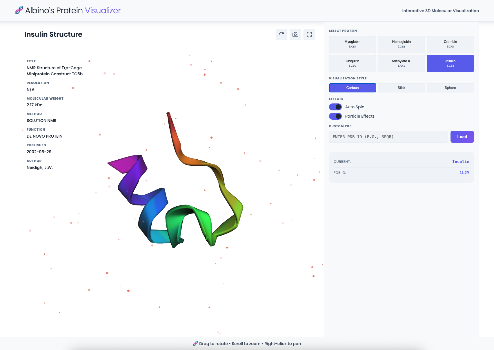

# Albino's Protein Visualizer

An interactive 3D protein structure visualization application that lets you explore the intricate world of molecular biology. Dive into the fascinating architecture of proteins—from oxygen-carrying hemoglobin to signal-regulating ubiquitin—and discover how these molecular machines are built.



## 🚀 Features

### Explore Protein Structures
- **Multiple Protein Structures**: Investigate a curated selection of proteins (Myoglobin, Hemoglobin, Crambin, Ubiquitin, Adenylate Kinase, Insulin)
- **Custom PDB Loading**: Query any protein from the Protein Data Bank by entering its 4-letter ID
- **Discover in Real-time**: Smooth 3D visualization powered by 3DMol.js

### Visualization Controls
- **Multiple Viewing Modes**: Cartoon, Stick, and Sphere representations to understand protein structure from different perspectives
- **Interactive Exploration**: Drag to rotate, scroll to zoom, right-click to pan—total control over your investigation
- **Enhanced Discovery**: Auto-spin mode for continuous observation and immersive viewing

## 🛠️ Technical Stack

- **Vite** - Lightning-fast build tool and dev server
- **3DMol.js** - WebGL-based molecular visualization library
- **Vanilla JavaScript** - No framework overhead, pure performance
- **CSS3** - Modern styling with CSS Grid, Flexbox, and custom properties
- **RCSB PDB API** - Real-time protein structure data fetching

## 📦 Installation

```bash
# Clone the repository
git clone <your-repo-url>
cd albinos-protein-viewer

# Install dependencies
npm install

# Start development server
npm run dev
```

## 🎯 Usage

1. **Select a Protein**: Click on any of the pre-loaded protein buttons in the left panel
2. **Change Visualization**: Choose different rendering styles (Cartoon, Stick, Sphere, Surface)
3. **Apply Color Schemes**: Select from various color schemes to highlight different aspects
4. **Load Custom Proteins**: Enter any 4-letter PDB ID in the custom input field
5. **Control the View**: Use mouse controls to rotate, zoom, and pan
6. **Take Screenshots**: Capture the current view as a PNG image
7. **Go Fullscreen**: Maximize the viewer for detailed analysis

## 🔬 Protein Structures Included

Explore these fascinating molecular machines:

1. **Myoglobin (1MBN)** - Stores oxygen in muscle cells, enabling athletic performance
2. **Hemoglobin (2DHB)** - Transports oxygen through your bloodstream with remarkable efficiency
3. **Crambin (1CRN)** - A small but powerful plant seed protein protecting against harsh conditions
4. **Ubiquitin (1UBQ)** - A cellular quality-control protein that marks damaged molecules for destruction
5. **Adenylate Kinase (1AKI)** - An energy transfer enzyme vital to cellular metabolism
6. **Insulin (1L2Y)** - Regulates blood sugar, one of nature's most important hormones

## 🌐 Browser Support

- Chrome/Edge (recommended)
- Firefox
- Safari
- Opera

## 📝 Code Quality

- **Well-Organized**: Clean separation of concerns for easy exploration of the codebase
- **State Management**: Centralized application state for predictable behavior
- **Error Handling**: Comprehensive feedback when things don't go as planned
- **Performance**: Optimized rendering to keep exploration smooth and responsive
- **Documentation**: Clear code comments to guide understanding

## 🚀 Deployment

```bash
# Build for production
npm run build

# Preview production build
npm run preview
```

The built files will be in the `dist` folder, ready for deployment to any static hosting service.

## 📚 Learning Resources

- [RCSB Protein Data Bank](https://www.rcsb.org/)
- [Vite Documentation](https://vitejs.dev/)

## 🎓 Technologies Used

This tool is built with curiosity-driven development in mind, combining:

- **Vite** - Lightning-fast development and build experience
- **3DMol.js** - WebGL-based molecular visualization for beautiful 3D rendering
- **Vanilla JavaScript** - Pure, straightforward code for clarity
- **CSS3** - Modern styling for a polished experience
- **RCSB PDB API** - Access to real scientific data on protein structures

The focus is on making complex molecular biology accessible and visually engaging.

## 📄 License

MIT License - feel free to use this project for learning and portfolio purposes.

---

**Built with ❤️ and curiosity**
